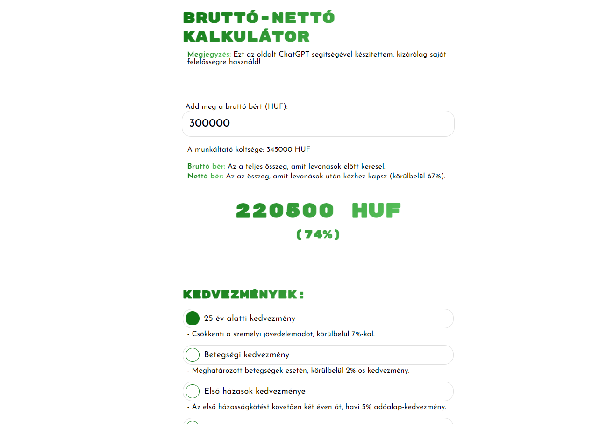

# Gross-to-Net Salary Calculator

This project is a simple web application that allows users to calculate their net salary based on their gross salary and various tax allowances in Hungary. The calculator updates results in real-time as users modify the input values and selected allowances.

## Features

- **Enter Gross Salary**: Users can input their gross salary in HUF.
- **Net Salary Calculation**: The application calculates the net salary after deducting taxes and contributions.
- **Tax Allowances**: Users can apply different tax allowances which affect the net salary amount:
  - Family tax allowance
  - First married couples allowance
  - Illness allowance
  - Under 25 allowance
  - Under 30 mothers allowance
  - Three or more children allowance

## Usage

1. **Enter Gross Salary**: Input your gross salary in the provided field.
2. **Select Tax Allowances**: Check the boxes next to the applicable allowances.
3. **View Results**: The result will automatically update, showing the net salary and its percentage.

## Files

- `index.html`: The HTML file of the application, containing the user interface and structure.
- `styles.css`: The stylesheet defining the appearance of the application.
- `color.css`: Additional stylesheet containing the color palette.
- `script.js`: The JavaScript file containing the logic and interactive functions of the application.

## Installation

1. Clone or download the project to your local machine.
2. Open the `index.html` file in a web browser.

## Contribution

If you have any suggestions, feedback, or questions, feel free to open an issue or submit a pull request. The project is open-source and all contributions are welcome.

## Note

This page was created with the assistance of ChatGPT. The results are for informational purposes only, and for precise tax rules, always consult a professional.